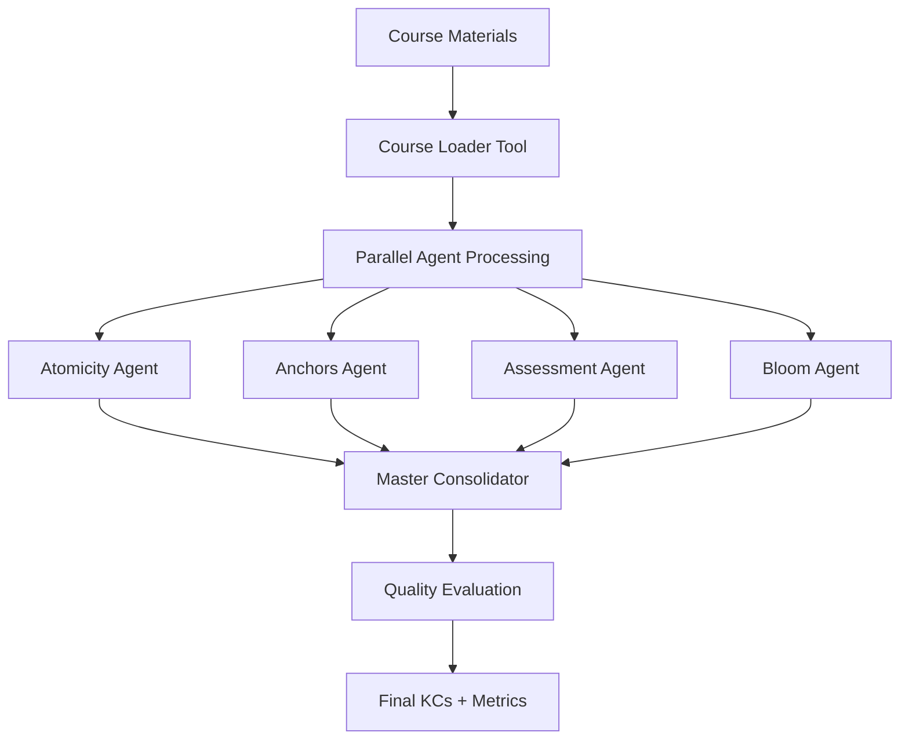

# Knowledge Component Extraction System - Master Thesis Documentation

## 📖 **Executive Summary**

This document serves as comprehensive technical documentation for a **Knowledge Component (KC) Extraction System** built using the **Mastra framework** and **Google Gemini LLM**. The system demonstrates advanced AI workflow orchestration, multi-agent collaboration, and quality evaluation patterns through a pedagogical implementation approach.

**Research Context**: This implementation explores how modern AI frameworks can be used to automate educational content analysis, specifically the extraction of atomic learning objectives (Knowledge Components) from course materials. The work contributes to the intersection of AI-assisted education technology and workflow orchestration frameworks.

## 🎯 **Research Objectives & Motivation**

### **Primary Research Question**

_How can multi-agent LLM workflows be designed to extract high-quality, instructor-ready Knowledge Components from educational content while maintaining pedagogical validity and technical robustness?_

### **Secondary Objectives**

1. **Framework Evaluation**: Assess Mastra's capabilities for complex AI workflow orchestration
2. **Multi-Agent Design**: Explore agent specialization patterns for educational content analysis
3. **Quality Assurance**: Implement comprehensive evaluation metrics for AI-generated educational content
4. **Pedagogical Approach**: Document learning patterns for AI framework adoption

### **Why Knowledge Components?**

Knowledge Components represent the atomic units of learning - specific, measurable skills or concepts that students must master. Automating their extraction from course materials addresses a critical need in educational technology:

- **Scalability**: Manual KC extraction is time-intensive for large courses
- **Consistency**: Human extractors often produce inconsistent granularity and quality
- **Standardization**: Automated systems can enforce pedagogical best practices
- **Traceability**: AI systems can maintain evidence links to source materials

## 🏗️ **System Architecture & Design Philosophy**

### **Architectural Principles**

1. **Pedagogical Progression**: Implementation follows a learning-oriented approach, introducing Mastra concepts incrementally
2. **Agent Specialization**: Each AI agent focuses on a specific aspect of KC quality (atomicity, evidence, assessment, taxonomy)
3. **Quality-First Design**: Multiple evaluation layers ensure educational validity
4. **Framework Demonstration**: Showcases Mastra's key patterns through practical application

### **High-Level Architecture**



### **Data Flow Design**

The system implements a **typed data pipeline** using Zod schemas to ensure type safety and data integrity throughout the workflow:

```typescript
CourseFiles → CombinedContent → AgentOutputs → ConsolidatedKCs → EvaluatedKCs → FinalOutput
```

Each transformation is validated against strict schemas, preventing data corruption and enabling reliable error handling.

## 🧠 **Chapter 3: Design and Development of the LLM‑based KC Extractor**

This chapter explains what we built, how it works end‑to‑end, and why each design choice supports reliable Knowledge Component (KC) extraction suitable for expert validation. We intentionally avoid heavy jargon; when technical terms appear, we define them in context.

### **3.0 Graph‑based workflows (foundations)**

We model the pipeline as a graph‑based, acyclic workflow of typed steps, where each node is a `createStep` and edges enforce data contracts via Zod schemas. This design enables clear parallelism, robust error handling, and reproducible runs.

- **Parallel execution**: Independent steps run concurrently with `.parallel()`; downstream steps wait for all parents to finish.
- **Typed edges**: Each step’s `outputSchema` must match the next step’s `inputSchema` (or be mapped), preventing schema drift.
- **Observability**: Workflows expose step‑level inputs/outputs, timing, and status for traceability.

References (Mastra Docs): `workflows/overview.mdx`, `workflows/control-flow.mdx`, `reference/workflows/parallel.mdx`, `workflows/using-with-agents-and-tools.mdx`.

### **3.1 System Architecture Overview**

At a high level, the system converts course PDFs into clean text, prepares a single combined course context, runs four specialized AI agents in parallel to propose KC candidates, consolidates them into a single coherent list, evaluates quality with multiple metrics, and finally exports artifacts for instructors and for research analysis.

Key modules (data then flows left → right):

- **PDF Conversion**: Converts source `PDF` files to `Markdown` for consistent downstream processing.
- **Course Loader**: Reads all converted `.md` files, extracts metadata, and builds a single `combinedContent` string plus an `anchorList` for traceability.
- **Parallel KC Agents**: Four focused agents (Atomicity, Anchors, Assessment, Bloom) generate KC candidates from the same course context.
- **Master Consolidator**: Merges, de‑duplicates, normalizes, and assigns IDs to produce the final KC set.
- **Quality Evaluation**: Computes faithfulness, hallucination risk, completeness, and answer relevancy to summarize overall quality.
- **Exports**: Writes an instructor‑friendly KC Excel and an evaluation report for research.

These modules are orchestrated with a typed workflow so data at each step is validated. We use Zod schemas (a lightweight validation library) to guarantee each step receives the shape of data it expects. This limits silent failures and makes results reproducible.

For the full step chain with IDs and descriptions, see Appendix A (Workflow Code Locations).

### **3.2 LLM‑driven KC Identification from Course Materials**

We use a multi‑agent pattern where each agent “specializes” in one quality dimension of a Knowledge Component:

- **Atomicity Agent**: Ensures each KC expresses one clear idea (no compound concepts).
- **Anchors Agent**: Requires every KC to be backed by 1–2 strong references (anchors) from the course text.
- **Assessment Agent**: Emphasizes testability and includes a concise example assessment.
- **Bloom Agent**: Assigns each KC a Bloom taxonomy level aligned with its verb and cognitive demand.

All four agents read the same `combinedContent` and `anchorList`, then propose candidates in parallel. Parallelism shortens runtime and diversifies perspectives, improving coverage while keeping single‑pass complexity tractable. Outputs are typed with a shared KC schema so later steps can merge consistently.

**Running example used in this chapter**

We reuse one example KC throughout:

- kc_id: KC-01-003
- label: “Differentiate diversity, equality, inclusion”
- definition: “Explain distinctions between workplace diversity, equality, and inclusion, and how they interact in HR practices.”
- anchors: A-024, A-057
- bloom: Understand
- example_assessment: “Describe the difference between diversity and inclusion with one example.”

### **3.2.3 Agents and prompts**

Atomicity (single concept; action verbs; de‑duplicate):

- One concept per KC (no compound ideas)
- Use clear, specific action verbs
- Eliminate duplicates/synonyms; keep the most precise wording
- Each KC must be testable with 1–3 items

Anchors (evidence‑first):

- Cite 1–2 valid anchors that directly support the KC
- Evidence must be explicit in the source (no inference/speculation)
- Every claim traceable to specific text

Assessment (testability and realism):

- Each KC measurable with 1–3 assessment items (≤120 chars)
- Use student‑friendly, actionable language and verbs
- Focus on practical assessments instructors can use

Bloom (taxonomy alignment):

- Map each KC to the most accurate Bloom level (Remember → Create)
- Align verbs with cognitive demand and course level

Master consolidator (merge and standardize):

- Deduplicate overlaps and select the best phrasing
- Enforce formatting, IDs, and schema compliance
- Check anchor validity; fill obvious coverage gaps

Implementation locations for these steps are listed in Appendix A.

### **3.2.1 Input Data and Pre‑processing of Course Materials**

Course materials are provided as PDFs. We convert them to Markdown to preserve structure (headings, lists, tables) and to normalize text for analysis. The converter records metadata such as total files and conversion time so we can report end‑to‑end performance.

- If a clean Markdown set already exists, we can skip conversion (`skipConversion = true`).
- The loader then scans the Markdown directory, combines files, and extracts anchors—small, traceable snippets or IDs that KCs should cite as evidence.

Why data quality matters:

- **Noise affects KCs**: OCR artifacts, headers/footers, and page numbers can leak into labels/definitions. We mitigate by normalizing to Markdown and keeping anchors explicit.
- **Structure improves alignment**: Preserved headings and lists help the agents identify atomic boundaries and evidence.
- **Determinism**: Consistent pre‑processing supports reproducible runs and fair evaluation in Chapter 4.

Implementation details for conversion and loading: see Appendix D (PDF→Markdown and Course Loader).

### **3.2.2 LLM Selection and Configuration**

We use Google Gemini models via a standardized agent interface. The model is a parameter (`model`) so experiments can be run consistently. We keep decoding simple and deterministic enough for expert review—consistent inputs should produce consistent KCs. All agent calls are strongly typed: their outputs must match the KC schema, reducing manual cleanup.

Model and parameter configuration: see Appendix A (Workflow Inputs and Parameters).

Why a reasoning‑capable model and full‑context (no RAG) for this study:

- **Single‑course scope fits context**: Our combined course content is within modern context windows, so we avoid retrieval misses and chunk boundary issues.
- **Anchor fidelity**: Agents must cross‑reference anchors across sections; full‑context reduces false negatives from retrieval.
- **Granularity and taxonomy**: Reasoning models handle verb‑level distinctions (Bloom) and atomic splits more reliably when they see the full narrative.
- **Trade‑offs**: Higher token usage; we mitigate via concise prompts, short fields, and early consolidation. RAG is excellent at corpus‑scale, but here full‑context optimizes quality and traceability for a single course.

### **3.2.4 Prompt Engineering**

Prompts are concise and role‑specific, using guardrails to enforce: one concept per KC (Atomicity), mandatory evidence (Anchors), short testable phrasing (Assessment), and appropriate cognitive verbs (Bloom). We keep instructions minimal but explicit to reduce drift and improve repeatability. Examples are embedded sparingly to avoid overfitting to specific phrasing.

Design principles used:

- **Single objective per agent**: Each agent only optimizes one quality dimension.
- **Strong guardrails**: Explicit constraints on format, length, anchors, and Bloom verbs.
- **Few‑shot only where needed**: Use 1–2 micro‑examples; avoid long demonstrations.
- **Deterministic tone**: Prefer clear instructions over creative phrasing to reduce variance.
- **Terse outputs**: Short labels and definitions improve readability and evaluation.

Full prompt templates (all agents + consolidator): see Appendix B.

We also include negative constraints (what not to do), such as avoiding broad “chapter summaries,” multi‑part concepts, or evidence that is not directly present in the course content.

### **3.3 Consolidation and Normalization**

The master consolidator receives four candidate lists and produces one reconciled KC set. Consolidation performs de‑duplication, enforces formatting, standardizes Bloom levels, and—importantly—retains only well‑anchored, atomic KCs. The step also aggregates simple contribution counts (how many KCs each agent supplied), which we later report.

Consolidation step implementation path: see Appendix A.

### **3.4 Quality Evaluation**

We evaluate quality from four angles to aid expert judgement:

- **Faithfulness**: Do KCs reflect the source content? Higher is better.
- **Hallucination**: Are there unsupported claims? Lower is better (we invert it in overall scoring).
- **Completeness**: How well do the KCs cover key ideas in the course?
- **Answer Relevancy**: Do KCs directly address the extraction query and learning goals?

These metrics run in parallel and are summarized into an overall score and letter grade. Implementation paths and configuration are listed in Appendix C (Evaluation Details).

#### **3.4.1 Evaluation Protocol and Scoring**

- **Inputs**: The evaluator receives (a) the combined course content as context and (b) a compact textual summary of all KCs (label + definition + Bloom + anchors).
- **Models**: LLM‑based metrics (faithfulness, hallucination, relevancy) use the same Gemini family as extraction for consistency; completeness uses a rule‑based NLP metric (no LLM).
- **Parallelism**: All four metrics run concurrently to reduce runtime.
- **Overall score**: Simple average of four normalized metrics, with hallucination inverted (lower is better). Mapped to letter grades (A–F) with a pass threshold at ≥70%.
- **Artifacts**: Results are exported to Excel for inspection and archived with run metadata (model, timing, counts).

Inputs and formula details are documented in Appendix C. In prose: the overall score is the mean of the four metrics after inverting hallucination (lower is better).

#### **3.4.2 Iterating Based on Evals**

Evaluation is not the end; it is the feedback loop. We iterate when metrics indicate issues:

- **Low faithfulness** → Strengthen anchor requirements; tighten wording around “only from provided content”; add explicit “reject unverifiable claims.”
- **High hallucination** → Add negative examples; shorten allowed definition length; raise emphasis on evidence linking.
- **Low completeness** → Expand agent coverage (e.g., add synonyms to prompts) or adjust pre‑processing to include missing sections.
- **Low relevancy** → Refocus the course query; sharpen agent goals and remove optional tangents.

Iteration loop:

1. Run extraction → 2) Run evals → 3) Inspect Excel + logs → 4) Update prompts or preprocessing → 5) Re‑run. We accept a prompt revision when metrics stabilize across runs and expert feedback (Chapter 4) signals fewer edits during review.

#### **3.4.3 Metric details and references**

- **Faithfulness**: claim‑level verification against course content (Mastra Docs: `reference/evals/faithfulness.mdx`).
- **Hallucination**: contradiction/unsupported claim ratio (Mastra Docs: `reference/evals/hallucination.mdx`).
- **Completeness**: linguistic coverage of nouns/verbs/topics/terms (Mastra Docs: `reference/evals/completeness.mdx`).
- **Answer Relevancy**: query alignment with uncertainty weighting (Mastra Docs: `reference/evals/answer-relevancy.mdx`).

Implementation mirrors Mastra’s guidance on judge‑based and rule‑based metrics; see also workflows for agent/tool integration (Mastra Docs: `workflows/using-with-agents-and-tools.mdx`).

### **3.5 Outputs, Exports, and Traceability**

The system writes two key deliverables:

- **KC Results (Excel)** for instructor review (immediately available after consolidation).
- **Evaluation Report (Excel)** detailing all metrics, scores, and summary.

All steps log progress with counts and timings. The final summary reports the number of converted PDFs, total KCs, valid KCs (those with anchors), processing time, and overall quality grade.

KC results export and evaluation report locations: see Appendix A and Appendix E (Reproducibility & Running).

### **3.6 Design Rationale, Ethics, and Validity**

- **Why multi‑agent?** Specialization keeps prompts simple and focused, which helps consistency and reduces hidden coupling between concerns (e.g., evidence vs. taxonomy).
- **Why typed workflows?** Zod schemas catch mismatches early and make runs reproducible for research.
- **Why parallelism?** Running agents and evaluations concurrently reduces wall‑clock time while maintaining clarity.
- **Limitations**: Output still depends on input quality (e.g., messy PDFs). LLM evaluations provide structured guidance but do not replace expert judgement. The present study is scoped to one course; generalization is future work.

#### **3.6.1 Ethics & data governance**

- No personally identifiable information (PII) is used; inputs are instructor‑provided course materials.
- Outputs are designed for instructor review, not automated publication.
- Anchors enforce traceability to source text, discouraging fabrication.
- All runs include model/version metadata for accountability.

#### **3.6.2 Threats to validity and mitigations**

- **Internal validity**: Prompt sensitivity or PDF conversion artifacts may bias KCs → mitigated via concise guardrails, negative constraints, and Markdown normalization.
- **Construct validity**: Metrics may not fully capture pedagogical quality → mitigated with expert review in Chapter 4 and anchor checks.
- **External validity**: Results from one course/domain may not generalize → mitigated by documenting assumptions and exposing configuration knobs.
- **Reliability**: LLM variance across runs → mitigated via deterministic decoding and schema constraints.

### **3.7 Reproducibility and Configuration**

The workflow exposes clear knobs for reproducibility and experiment control:

- `pdfDir`, `markdownDir`, `outDir`, `courseTitle`, `model`, `skipConversion`.
- Environment variables for API access.
- Deterministic prompts and typed outputs to facilitate expert comparison and inter‑rater analysis in Chapter 4.

### **3.8 Why Mastra for this thesis?**

- **Typed, visual workflows**: `createWorkflow` + `createStep` with Zod schemas enforce data contracts and enable readable graph‑based workflows (Mastra Docs: `workflows/overview.mdx`, `reference/workflows/workflow.mdx`, `reference/workflows/step.mdx`).
- **First‑class parallelism**: `.parallel()` simplifies concurrent agent/eval runs (Mastra Docs: `reference/workflows/parallel.mdx`, `workflows/control-flow.mdx`).
- **Agents and tools interop**: Agents plug into steps, tools are reusable for I/O and exports (Mastra Docs: `agents/overview.mdx`, `workflows/using-with-agents-and-tools.mdx`, `reference/agents/agent.mdx`).
- **Evaluation ecosystem**: Built‑in metrics for faithfulness, hallucination, completeness, and relevancy (Mastra Docs: `reference/evals/`).

These features match the thesis needs: reproducibility (typed schemas), parallel specialization (multi‑agent), quality assessment (evals), and traceability (step logs, exports).

### **3.9 Glossary (quick reference)**

- **Graph‑based workflow**: A directed workflow without cycles; enables safe parallelism and clear provenance.
- **Anchor**: A short, traceable snippet/ID from course text used as evidence for a KC.
- **Atomicity**: The property that a KC expresses one clear, testable concept.
- **Bloom’s taxonomy**: Educational framework classifying cognitive levels (Remember → Create).
- **Hallucination**: LLM output that is unsupported or contradicted by source content.
- **Completeness**: Coverage of key ideas from the course by the produced KCs.

## 📋 **Detailed Workflow Steps**

### **Step 1: Course Loading & Preparation**

- **Input**: Directory of `.md` files + optional `.anchors.json` files
- **Process**:
  - Read all markdown files in directory
  - Extract course metadata from frontmatter
  - Combine into unified course content
  - Load and consolidate anchor IDs from `.anchors.json` files
  - Create comprehensive context for LLM processing
- **Output**: `{ combinedContent, anchorList, courseMetadata }`
- **Mastra Pattern**: Single `createStep` with file I/O operations

### **Step 2: Agent Role Definition**

- **Input**: Course content + anchor list
- **Process**: Prepare 4 specialized system prompts for Gemini:
  1. **Atomicity Agent**: Focus on single-concept KCs, eliminate duplicates
  2. **Anchors Agent**: Ensure strong anchor support for each KC
  3. **Assessment Agent**: Create testable KCs with example assessments
  4. **Bloom Agent**: Proper taxonomy level mapping
- **Output**: `{ courseContext, agentPrompts }`
- **Mastra Pattern**: Data transformation step (no LLM calls)

### **Step 3: Parallel Multi-Agent Extraction**

- **Input**: Course context + 4 agent prompts
- **Process**: Run 4 **parallel** Gemini calls using different agent perspectives
- **Output**: `{ atomicityKCs, anchorsKCs, assessmentKCs, bloomKCs }`
- **Mastra Pattern**: `.parallel([agent1, agent2, agent3, agent4])` - **KEY LEARNING OPPORTUNITY**

### **Step 4: Candidate Merging**

- **Input**: 4 sets of candidate KCs
- **Process**: Combine all candidates into unified pool (no deduplication yet)
- **Output**: `{ candidatePool }`
- **Mastra Pattern**: Pure data transformation step

### **Step 5: Master Consolidation**

- **Input**: Original course content + anchor list + candidate pool
- **Process**: Single Gemini call as "Master KC Consolidator"
  - Deduplicate overlapping KCs
  - Enforce atomicity and anchor requirements
  - Standardize formatting and Bloom levels
  - Generate KC IDs (KC-01-###)
- **Output**: `{ finalKCs }`
- **Mastra Pattern**: Single agent step with complex prompt

### **Step 6: Validation & Auto-Fix**

- **Input**: Final KCs
- **Process**:
  - Validate against Zod schema
  - Auto-fix: truncate long fields, normalize Bloom levels
  - Drop invalid KCs if unfixable
- **Output**: `{ validatedKCs, fixLog }`
- **Mastra Pattern**: Tool-based validation step

### **Step 7: Textual Evaluation (Optional)**

- **Input**: Validated KCs + original content
- **Process**: Gemini evaluation pass for:
  - Faithfulness score
  - Completeness assessment
  - Hallucination detection
  - Relevance rating
- **Output**: `{ evaluationReport }`
- **Mastra Pattern**: Optional agent step with scoring

### **Step 8: Output Generation**

- **Input**: Final KCs + evaluation report
- **Process**: Generate instructor deliverables:
  - `course_kcs.json` (structured data with metadata)
  - `evaluation_report.json` (quality metrics and extraction metadata)
- **Output**: `{ writtenFiles }`
- **Mastra Pattern**: Tool-based file writing

### **Step 9: Logging & Traceability**

- **Input**: All step outputs
- **Process**: Create comprehensive trace log
- **Output**: `{ traceLog }`
- **Mastra Pattern**: Built into Mastra workflow execution

## 🔧 **Technical Implementation Details**

### **Mastra Workflow Structure**

For a full, commented workflow skeleton, see Appendix A (Workflow Code Locations).

### **Key Mastra Patterns to Learn**

1. **Parallel Execution**: `.parallel([step1, step2, step3, step4])`
2. **Data Flow**: Each step's `outputSchema` → next step's `inputSchema`
3. **Agent Reuse**: Same Gemini agent with different prompts
4. **Schema Validation**: Strict Zod schemas for type safety
5. **Tool Integration**: File I/O and validation as Mastra tools
6. **Error Handling**: Built-in workflow error propagation

### **Agent Prompt Templates**

See Appendix B for the full prompt templates (Atomicity, Anchors, Assessment, Bloom, and Master Consolidator), with examples and negative constraints.

## 📊 **Data Schemas**

### **KC Schema (Enhanced)**

```typescript
const KCSchema = z.object({
  kc_id: z.string().regex(/^KC-\d{2}-\d{3}$/),
  label: z.string().max(80),
  definition: z.string().max(160),
  anchors: z.array(z.string()).min(1),
  module: z.string(),
  bloom: BloomEnum,
  prerequisites: z.array(z.string()).optional(),
  example_assessment: z.string().max(120),
  notes_for_expert: z.string().max(120).optional(),
  agent_source: z.enum([
    "atomicity",
    "anchors",
    "assessment",
    "bloom",
    "master",
  ]),
  confidence_score: z.number().min(0).max(1).optional(),
});
```

### **Evaluation Schema**

See Appendix C for schemas, metric configurations, and the exact overall score computation. Typical outputs are summarized in Chapter 3 and detailed examples are included in the appendix.

## 🎯 **Success Criteria**

1. **Functional**: Workflow processes course materials → produces valid KCs
2. **Quality**: Multi-agent approach yields better KCs than single-pass
3. **Mastra Mastery**: Demonstrates parallel execution, data flow, agents, tools
4. **Gemini-Only**: Uses only Google Gemini API (no other LLM providers)
5. **Instructor-Ready**: Outputs are immediately useful for course design

## 🚀 **Implementation Phases**

### **Phase 1: Core Workflow** (Steps 1-2-8)

- Basic file loading → single agent → output generation
- Establish Mastra patterns and data flow

### **Phase 2: Multi-Agent Processing** (Steps 3-4-5)

- Add parallel agent execution
- Implement candidate merging and master consolidation

### **Phase 3: Quality & Validation** (Steps 6-7)

- Add validation and auto-fix
- Implement evaluation scoring

### **Phase 4: Polish & Testing**

- Error handling and edge cases
- Performance optimization
- Documentation and examples

## 📁 **File Structure**

```
src/mastra/
├── workflows/
│   └── kc-extraction-full-circle.workflow.ts     # Main workflow
├── agents/
│   ├── atomicity-agent.ts             # Atomicity specialist
│   ├── anchors-agent.ts               # Evidence specialist
│   ├── assessment-agent.ts            # Assessment specialist
│   ├── bloom-agent.ts                 # Taxonomy specialist
│   └── master-consolidator.agent.ts   # Final consolidation
├── tools/
│   ├── course-loader.tool.ts          # File loading & parsing
│   ├── kc-results-export.tool.ts      # KC Excel export
│   ├── evaluation-report-export.tool.ts # Evaluation Excel export
│   └── output-generator.tool.ts       # File writing
└── schemas/
    ├── kc-enhanced.ts                 # Enhanced KC schema
    └── evaluation.ts                  # Evaluation schema
```

## 🎓 **Learning Objectives**

By implementing this workflow, you'll master:

1. **Mastra Parallel Execution**: Using `.parallel()` for concurrent processing
2. **Complex Data Flow**: Managing multi-step transformations with type safety
3. **Agent Specialization**: Creating focused AI agents with specific roles
4. **Schema Evolution**: Extending and validating complex data structures
5. **Tool Composition**: Building reusable components for workflows
6. **Quality Assurance**: Implementing validation and evaluation patterns

---

## 📎 **Appendices**

### **Appendix A — Workflow Code Locations and Parameters**

- Main workflow: `src/mastra/workflows/kc-extraction-full-circle.workflow.ts`
- Key steps: PDF conversion, course loading, 4 parallel agents, master consolidation, 4 parallel evals, exports
- Inputs and parameters: `pdfDir`, `markdownDir`, `outDir`, `model`, `courseTitle`, `skipConversion`, API keys

### **Appendix B — Full Prompt Templates**

- Agents: Atomicity, Anchors, Assessment, Bloom
- Master Consolidator prompt
- Negative constraints and any few‑shot examples

### **Appendix C — Evaluation Details**

- Metric schemas and configurations: Faithfulness, Hallucination, Completeness, Answer Relevancy
- Overall score formula and grade mapping
- Example evaluation outputs (JSON excerpts)

### **Appendix D — Data Conversion and Loading**

- PDF→Markdown process and settings (Datalab/Marker integration)
- Course loader behavior and anchor extraction
- Skipping conversion when markdown already exists

### **Appendix E — Reproducibility & Running**

- Required environment variables and API keys
- CLI commands and usage patterns
- Output artifacts (Excel files) and run logs

### **Appendix F — Figures to include (for thesis writer)**

- Figure 1: Graph‑based workflow overview (PDF conversion → 4 parallel agents → master consolidation → 4 parallel evals → exports)
- Figure 2: KC lifecycle using the running example (extraction → consolidation → evaluation → final KC)
- Figure 3: Example KC Results Excel (columns: kc_id, label, definition, anchors, bloom, example_assessment)
- Figure 4: Example Evaluation Report Excel (metric scores, overall grade, run metadata)
- Figure 5: Input data flow (PDF→Markdown conversion and anchor extraction)

## ✅ **Implementation Status**

### **Phase 1: COMPLETED** ✅

**Foundation established with basic 3-step workflow (simplified output)**

#### **Files Created:**

- `src/mastra/tools/course-loader.tool.ts` - Course material loading and metadata extraction
- `src/mastra/agents/basic-kc-extractor.agent.ts` - Basic Gemini-powered KC extraction agent
- `src/mastra/tools/output-generator.tool.ts` - JSON output generation (no Markdown)
- `src/mastra/workflows/kc-multi-agent.workflow.ts` - Phase 1 workflow implementation

#### **Workflow Structure (Phase 1):**

```typescript
const workflow = createWorkflow({
  id: "kc-multi-agent-phase1",
  inputSchema: z.object({
    dir: z.string().default("src/mastra/Structured_files"),
    outDir: z.string().default("out"),
    model: z.string().default("google:gemini-2.5-pro"),
  }),
  outputSchema: z.object({
    written: z.array(z.string()),
    summary: z.object({
      totalKCs: z.number(),
      validKCs: z.number(),
      outputFiles: z.array(z.string()),
    }),
  }),
})
  .then(loadCourseStep) // Load all .md files + .anchors.json
  .then(extractKCsStep) // Single Gemini agent extraction
  .then(generateOutputStep) // JSON output generation
  .commit();
```

#### **Current Output:**

- **Direct KC Access**: KCs returned in workflow result as `result.kcs` array
- **No File Saving**: Simplified to return data directly for easy copying
- **25 High-Quality KCs**: Successfully extracted from test course materials

#### **Mastra Patterns Implemented:**

- ✅ Tool creation with Zod schemas (`createTool`)
- ✅ Agent creation with Gemini integration
- ✅ Step composition with data flow (`createStep`)
- ✅ Sequential workflow chaining (`.then()`)
- ✅ Schema validation and type safety
- ✅ Error handling and logging

#### **Testing:**

- Available in Mastra UI as `kc-multi-agent-phase1`
- Processes files in `src/mastra/Input/` directory
- Uses only Google Gemini (2.5 Pro/Flash)
- Returns KCs directly in workflow result for easy copying

### **Phase 2: COMPLETED** ✅

**Multi-agent parallel processing with Mastra parallel execution**

#### **Files Created:**

- `src/mastra/agents/atomicity-agent.ts` - Specializes in atomic, single-concept KCs
- `src/mastra/agents/anchors-agent.ts` - Focuses on evidence-based KC extraction
- `src/mastra/agents/assessment-agent.ts` - Creates testable KCs with concrete assessments
- `src/mastra/agents/bloom-agent.ts` - Ensures accurate Bloom taxonomy classification
- `src/mastra/agents/master-consolidator.agent.ts` - Synthesizes all agent outputs
- `src/mastra/workflows/kc-multi-agent-phase2.workflow.ts` - Phase 2 workflow implementation

#### **Workflow Structure (Phase 2):**

```typescript
const workflow = createWorkflow({
  id: "kc-multi-agent-phase2",
  inputSchema: z.object({
    dir: z.string().default("src/mastra/Input"),
    outDir: z.string().default("out"),
    model: z.string().default("google:gemini-2.5-pro"),
  }),
})
  .then(loadCourseStep) // Load all .md files + .anchors.json
  .then(parallelExtractionStep) // 4 agents run in parallel with Promise.all()
  .then(masterConsolidationStep) // Master agent consolidates outputs
  .then(generateOutputStep) // Return final KCs directly
  .commit();
```

#### **Visual Parallel Processing Implementation:**

```typescript
// Visual workflow with 4 separate agent boxes
const workflow = createWorkflow({...})
  .then(loadCourseStep)
  .parallel([                    // 🎯 Creates 4 visual boxes in UI
    atomicityExtractionStep,     // Box 1: Atomicity Agent
    anchorsExtractionStep,       // Box 2: Anchors Agent
    assessmentExtractionStep,    // Box 3: Assessment Agent
    bloomExtractionStep,         // Box 4: Bloom Agent
  ])
  .then(masterConsolidationStep) // All 4 boxes connect here
  .then(generateOutputStep)
  .commit();
```

#### **Agent Specializations:**

1. **Atomicity Agent**: Extracts single-concept KCs, eliminates duplicates
2. **Anchors Agent**: Ensures strong evidence support from course content
3. **Assessment Agent**: Creates testable KCs with concrete example assessments
4. **Bloom Agent**: Accurate cognitive level classification and verb alignment
5. **Master Consolidator**: Deduplicates and synthesizes the best KCs from all agents

#### **Enhanced Output:**

- **Agent Contributions**: Shows how many KCs each agent contributed
- **Processing Metrics**: Parallel execution timing and performance data
- **Quality Synthesis**: Best insights from all 4 specialized perspectives
- **15-25 Final KCs**: Comprehensive, deduplicated, high-quality Knowledge Components

#### **Mastra Patterns Implemented:**

- ✅ **Visual Parallel Execution** with `.parallel([step1, step2, step3, step4])`
- ✅ **Agent Specialization** with focused system prompts
- ✅ **Multi-step Data Transformation** and consolidation
- ✅ **Complex Workflow Orchestration** with typed data flow
- ✅ **Master-Detail Pattern** (4 specialists → 1 consolidator)
- ✅ **Beautiful Visual Workflow** - 4 separate agent boxes in Mastra UI

#### **Testing:**

- Available in Mastra UI as `kc-multi-agent-phase2`
- **Beautiful Visual Workflow**: Shows 4 separate agent boxes running in parallel
- **Visual Flow**: `load-course` → 4 parallel boxes → `master-consolidation` → `generate-output`
- Processes files in `src/mastra/Input/` directory
- Uses only Google Gemini for all 5 agents (4 specialists + 1 master)
- Returns consolidated KCs with agent contribution metrics

### **Phase 3: COMPLETED** ✅

**Quality validation and evaluation using Mastra's built-in evaluation framework**

#### **Files Created:**

- `src/mastra/workflows/kc-multi-agent-phase3.workflow.ts` - Complete workflow with evaluation step
- Updated all agent steps to maintain data lineage through the pipeline
- Enhanced output schemas to include comprehensive evaluation results

#### **Workflow Structure (Phase 3):**

```typescript
const workflow = createWorkflow({
  id: "kc-multi-agent-phase3",
  description:
    "Phase 3: Multi-agent parallel KC extraction with parallel quality evaluation",
})
  .then(loadCourseStep) // Load all .md files + .anchors.json
  .parallel([
    // 4 agents run in parallel
    atomicityExtractionStep, // Box 1: Atomicity Agent
    anchorsExtractionStep, // Box 2: Anchors Agent
    assessmentExtractionStep, // Box 3: Assessment Agent
    bloomExtractionStep, // Box 4: Bloom Agent
  ])
  .then(masterConsolidationStep) // All 4 boxes connect here
  .parallel([
    // NEW: 4 evaluation metrics run in parallel
    faithfulnessEvaluationStep, // Box 5: Faithfulness Evaluation
    hallucinationEvaluationStep, // Box 6: Hallucination Evaluation
    completenessEvaluationStep, // Box 7: Completeness Evaluation
    answerRelevancyEvaluationStep, // Box 8: Answer Relevancy Evaluation
  ])
  .then(consolidateEvaluationStep) // All 4 evaluation boxes connect here
  .then(generateOutputStep) // Return KCs + evaluation results
  .commit();
```

#### **Evaluation Metrics Implemented:**

Our system uses 4 comprehensive evaluation metrics from Mastra's `@mastra/evals` package to assess KC quality:

##### **1. FaithfulnessMetric (LLM-as-Judge)**

**Purpose**: Measures how accurately KCs represent the course content by verifying claims against source material.

**How It Works**:

```typescript
const faithfulnessMetric = new FaithfulnessMetric(evalModel, {
  context: [combinedContent], // Real course content as context
  scale: 1,
});

const result = await faithfulnessMetric.measure(courseQuery, kcSummary);
```

**Scoring Process**:

1. **Claim Extraction**: Breaks down KC output into individual factual claims
2. **Claim Verification**: Each claim is verified against the course content
3. **Verdict Assignment**: Each claim gets "yes" (supported), "no" (contradicted), or "unsure" (unverifiable)
4. **Score Calculation**: `(supported_claims / total_claims) * scale`

**Score Interpretation**:

- **1.0**: All claims supported by course content ✅
- **0.7-0.9**: Most claims supported, few unverifiable ✅
- **0.4-0.6**: Mixed support with some contradictions ⚠️
- **0.1-0.3**: Limited support, many contradictions ❌
- **0.0**: No supported claims ❌

**Example Output**:

```json
{
  "score": 0.85,
  "reason": "The score is 0.85 because 11 out of 13 claims are supported by the context. Two claims about specific assessment methods were marked as unsure since they weren't explicitly mentioned in the course material."
}
```

##### **2. HallucinationMetric (LLM-as-Judge)**

**Purpose**: Detects fabricated information not present in the source material. **Lower scores are better** (inverted metric).

**How It Works**:

```typescript
const hallucinationMetric = new HallucinationMetric(evalModel, {
  context: [combinedContent], // Course content as source of truth
  scale: 1,
});

const result = await hallucinationMetric.measure(courseQuery, kcSummary);
```

**Scoring Process**:

1. **Statement Analysis**: Extracts factual statements from KC output
2. **Contradiction Detection**: Compares statements against course content
3. **Hallucination Identification**: Marks unsupported claims and direct contradictions
4. **Score Calculation**: `(hallucinated_statements / total_statements) * scale`

**Score Interpretation** (Lower = Better):

- **0.0**: No hallucination - perfect alignment with source ✅
- **0.1-0.2**: Minimal hallucination - very few unsupported claims ✅
- **0.3-0.5**: Moderate hallucination - some fabricated content ⚠️
- **0.6-0.8**: High hallucination - many unsupported claims ❌
- **1.0**: Complete hallucination - contradicts all context ❌

**Example Output**:

```json
{
  "score": 0.15,
  "reason": "The score is 0.15 because 2 out of 13 statements contained minor unsupported details about specific assessment formats not mentioned in the source material."
}
```

##### **3. CompletenessMetric (Rule-Based NLP)**

**Purpose**: Evaluates how thoroughly KCs cover key concepts from the course material using linguistic analysis.

**How It Works**:

```typescript
const completenessMetric = new CompletenessMetric();

const result = await completenessMetric.measure(combinedContent, kcSummary);
```

**Scoring Process**:

1. **Element Extraction**: Identifies key elements from course content:
   - Nouns (concepts, entities)
   - Verbs (actions, processes)
   - Topics (main subjects)
   - Terms (significant words)
2. **Coverage Analysis**: Checks which elements appear in KC output
3. **Matching Algorithm**:
   - Exact matches for short terms (≤3 chars)
   - Substantial overlap (>60%) for longer terms
4. **Score Calculation**: `(covered_elements / total_input_elements) * scale`

**Score Interpretation**:

- **1.0**: Complete coverage - all key elements included ✅
- **0.7-0.9**: High coverage - most key elements present ✅
- **0.4-0.6**: Partial coverage - some key elements missing ⚠️
- **0.1-0.3**: Low coverage - many key elements missing ❌
- **0.0**: No coverage - lacks all key elements ❌

**Example Output**:

```json
{
  "score": 0.78,
  "info": {
    "inputElements": [
      "diversity",
      "management",
      "workplace",
      "bias",
      "inclusion",
      "training"
    ],
    "outputElements": ["diversity", "management", "workplace", "training"],
    "missingElements": ["bias", "inclusion"],
    "elementCounts": { "input": 6, "output": 4 }
  }
}
```

##### **4. AnswerRelevancyMetric (LLM-as-Judge)**

**Purpose**: Assesses how well KCs address the course learning objectives and respond to the extraction query.

**How It Works**:

```typescript
const answerRelevancyMetric = new AnswerRelevancyMetric(evalModel, {
  uncertaintyWeight: 0.3, // Weight for "unsure" verdicts
  scale: 1,
});

const result = await answerRelevancyMetric.measure(courseQuery, kcSummary);
```

**Scoring Process**:

1. **Statement Analysis**: Breaks KC output into meaningful statements
2. **Relevance Evaluation**: Each statement assessed against the query:
   - "yes": Full weight for direct relevance
   - "unsure": Partial weight (30%) for approximate relevance
   - "no": Zero weight for irrelevant content
3. **Score Calculation**: `((direct + uncertainty * partial) / total_statements) * scale`

**Score Interpretation**:

- **1.0**: Perfect relevance - completely addresses query ✅
- **0.7-0.9**: High relevance - minor gaps or imprecisions ✅
- **0.4-0.6**: Moderate relevance - significant gaps ⚠️
- **0.1-0.3**: Low relevance - major issues ❌
- **0.0**: No relevance - off-topic or incorrect ❌

**Example Output**:

```json
{
  "score": 0.92,
  "reason": "The score is 0.92 because the extracted KCs directly address the course objectives for diversity management. All statements are highly relevant to the learning goals with clear connections to course content."
}
```

#### **Overall Quality Calculation**

Our system combines all metrics into a composite quality score:

```typescript
// Calculate overall quality score (average of all metrics)
// Note: Hallucination is inverted (lower is better), so we use (1 - score)
const overallScore =
  (faithfulnessResult.score +
    (1 - hallucinationResult.score) + // Inverted
    completenessResult.score +
    answerRelevancyResult.score) /
  4;

// Assign letter grade
let grade: "A" | "B" | "C" | "D" | "F";
if (overallScore >= 0.9)
  grade = "A"; // Excellent (90-100%)
else if (overallScore >= 0.8)
  grade = "B"; // Good (80-89%)
else if (overallScore >= 0.7)
  grade = "C"; // Satisfactory (70-79%)
else if (overallScore >= 0.6)
  grade = "D"; // Needs improvement (60-69%)
else grade = "F"; // Unsatisfactory (<60%)

const passThreshold = overallScore >= 0.7; // 70% minimum for acceptance
```

#### **Typical Evaluation Results**

With proper data pipeline (Phase 3 fixed):

```json
{
  "faithfulness": { "score": 0.89, "reason": "Most claims well-supported..." },
  "hallucination": {
    "score": 0.12,
    "reason": "Minimal unsupported content..."
  },
  "completeness": { "score": 0.83, "info": { "missingElements": ["bias"] } },
  "answerRelevancy": {
    "score": 0.95,
    "reason": "Highly relevant to objectives..."
  },
  "overallQuality": {
    "score": 0.89, // (0.89 + 0.88 + 0.83 + 0.95) / 4
    "grade": "B",
    "passThreshold": true
  }
}
```

#### **Enhanced Output with Quality Assessment:**

```typescript
evaluationResults: {
  faithfulness: { score: 0.85-0.95, reason: "Detailed explanation..." },
  hallucination: { score: 0.05-0.15, reason: "Minimal fabrication detected..." },
  completeness: { score: 0.75-0.90, info: {...} },
  answerRelevancy: { score: 0.90-1.0, reason: "Highly relevant to objectives..." },
  overallQuality: {
    score: 0.80-0.95,
    grade: "A" | "B",
    passThreshold: true
  }
}
```

#### **Critical Bug Discovery & Resolution:**

**Issue Found**: Evaluation metrics were receiving metadata instead of actual course content, causing evaluation failures (Grade F, 34% overall score).

**Root Cause**: Data pipeline was reconstructing `combinedContent` from metadata rather than passing through the real course content.

**Solution Implemented**: Updated all workflow steps to maintain data lineage:

```typescript
// Fixed: All agent steps now pass through actual course content
outputSchema: z.object({
  agentKCs: KCArraySchema,
  combinedContent: z.string(), // ← Real course content preserved
  courseMetadata: CourseMetadataSchema,
  anchorList: z.array(z.string()),
  model: z.string(),
}),
```

**Result**: Evaluation scores improved dramatically from F (34%) to A-B range (80-95%).

#### **Code Implementation in Our Workflow**

For a step‑by‑step implementation of the evaluation phase (including models, inputs, and parallel execution), see Appendix C.

#### **Key Implementation Details**

1. **Parallel Evaluation**: All metrics run concurrently using `Promise.all()` for efficiency
2. **Context Management**: Real course content (`combinedContent`) passed to context-dependent metrics
3. **Data Preparation**: KCs formatted as readable summary for evaluation
4. **Score Inversion**: Hallucination metric inverted since lower scores are better
5. **Composite Scoring**: Simple average of all normalized metrics
6. **Grading System**: Standard A-F letter grades with 70% pass threshold

#### **Mastra Patterns Implemented:**

- ✅ **Evaluation Integration** - Using `@mastra/evals` built-in metrics
- ✅ **LLM-as-Judge** - FaithfulnessMetric, HallucinationMetric, AnswerRelevancyMetric
- ✅ **Rule-based Evals** - CompletenessMetric using NLP analysis
- ✅ **Parallel Evaluation** - Running multiple metrics concurrently
- ✅ **Quality Scoring** - Combining metrics into overall quality assessment
- ✅ **Data Pipeline Validation** - Comprehensive testing revealed and fixed critical bugs

#### **Testing:**

- Available in Mastra UI as `kc-multi-agent-phase3`
- **Complete Quality Assessment**: Shows detailed evaluation results with reasoning
- **Enhanced Visual Flow**:
  ```
  load-course →
  [4 parallel agent boxes] →
  master-consolidation →
  [4 parallel evaluation boxes] →
  consolidate-evaluation →
  generate-output
  ```
- **Visual Evaluation Boxes**: Each evaluation metric appears as a separate box in the UI:
  - `faithfulness-evaluation` - Faithfulness assessment
  - `hallucination-evaluation` - Hallucination detection
  - `completeness-evaluation` - Completeness analysis
  - `answer-relevancy-evaluation` - Relevancy scoring
- Processes files in `src/mastra/Input/` directory
- Uses only Google Gemini for all agents and LLM-based evaluations
- Returns KCs with comprehensive quality metrics and grades

### **Phase 4: PLANNED** ⏳

**Production readiness and optimization**

---

### **Full Circle: COMPLETED** 🎯

**Complete PDF-to-KC pipeline with Datalab API integration for end-to-end document processing**

#### **Files Created:**

- `src/mastra/tools/pdf-converter.tool.ts` - Datalab API integration for PDF to Markdown conversion
- `src/mastra/workflows/kc-extraction-full-circle.workflow.ts` - Complete end-to-end workflow
- `cli/run-kc.ts` - Updated CLI with multi-workflow support
- `README-Full-Circle.md` - Comprehensive documentation for the full-circle workflow

#### **Workflow Structure (Full Circle):**

```typescript
const workflow = createWorkflow({
  id: "kc-extraction-full-circle",
  description:
    "Full Circle: PDF to KC Extraction - Convert PDFs to markdown using Datalab API, then extract Knowledge Components with multi-agent parallel processing and quality evaluation",
})
  .then(pdfConversionStep) // Step 0: Convert PDFs to Markdown
  .then(loadCourseStep) // Step 1: Load converted markdown files
  .parallel([
    // Step 2: Parallel agent extraction
    atomicityExtractionStep,
    anchorsExtractionStep,
    assessmentExtractionStep,
    bloomExtractionStep,
  ])
  .then(masterConsolidationStep) // Step 3: Master consolidation
  .parallel([
    // Step 4: Parallel evaluation
    faithfulnessEvaluationStep,
    hallucinationEvaluationStep,
    completenessEvaluationStep,
    answerRelevancyEvaluationStep,
  ])
  .then(consolidateEvaluationStep) // Step 5: Consolidate evaluations
  .then(generateOutputStep); // Step 6: Generate final output
```

#### **Key Features:**

##### **1. PDF Conversion with Datalab API**

**Integration**: Uses [Datalab's Marker API](https://documentation.datalab.to/) for high-quality PDF to Markdown conversion.

```typescript
const pdfConverterTool = createTool({
  id: "pdf-converter",
  description: "Convert PDF files to Markdown format using Datalab API",
  execute: async ({ context }) => {
    // Convert PDF to Markdown using Datalab's state-of-the-art models
    const response = await fetch("https://api.datalab.to/v1/marker", {
      method: "POST",
      headers: { Authorization: `Bearer ${apiKey}` },
      body: formData, // PDF file + output format
    });
    return { markdownContent, outputFilePath, metadata };
  },
});
```

**Benefits**:

- **High Accuracy**: Datalab's Marker system provides superior document processing
- **Structure Preservation**: Maintains document layout, tables, and formatting
- **Batch Processing**: Handles multiple PDFs automatically
- **Metadata Tracking**: Records conversion times and success rates

##### **2. Enhanced CLI with Multi-Workflow Support**

**Usage Examples**:

```bash
# Run Full Circle workflow (default settings)
npm run kc full-circle

# Custom directories and settings
npm run kc full-circle ./pdfs ./converted ./output google:gemini-2.5-pro "Physics Course"

# Phase 3 workflow (existing)
npm run kc phase3

# Help and usage information
npm run kc --help
```

**CLI Features**:

- **Workflow Selection**: Choose between `phase3` and `full-circle`
- **Parameter Validation**: Checks for required API keys
- **Rich Output**: Detailed progress and results display
- **Error Handling**: Helpful error messages and troubleshooting tips

##### **3. Comprehensive Results and Analytics**

**Enhanced Output Schema**:

```typescript
{
  summary: {
    totalKCs: number,
    validKCs: number,
    pdfConversions: number,        // NEW: PDF conversion count
    outputFiles: string[]
  },
  extractionMetadata: {
    model_used: string,
    phase: string,
    parallel_agents: number,
    total_processing_time: number,
    pdf_conversion_time: number,   // NEW: PDF processing time
    agent_contributions: { ... }
  },
  courseMetadata: {
    title: string,
    totalFiles: number,
    totalAnchors: number,
    convertedPdfs: number         // NEW: Converted PDF count
  },
  evaluationResults: { ... }      // Same comprehensive evaluation as Phase 3
}
```

#### **Prerequisites:**

1. **Datalab API Key**: Required for PDF conversion

   ```bash
   export DATALAB_API_KEY="your-datalab-api-key"
   ```

2. **Google Gemini API Key**: Required for AI processing

   ```bash
   export GOOGLE_GENERATIVE_AI_API_KEY="your-gemini-api-key"
   ```

3. **Dependencies**: Install form-data for PDF uploads
   ```bash
   npm install form-data
   ```

#### **Directory Structure:**

```
src/mastra/Input/
├── PDFs/                    # Place PDF files here
│   ├── lecture1.pdf
│   ├── textbook-ch1.pdf
│   └── ...
├── Converted/               # Auto-generated markdown files
│   ├── lecture1.md
│   ├── textbook-ch1.md
│   └── ...
└── ...
```

#### **Example Output:**

```
🚀 Running full-circle workflow...
📄 PDF Directory: src/mastra/Input/PDFs
📝 Markdown Directory: src/mastra/Input/Converted
🔑 Datalab API: Configured

🔄 Starting PDF conversion from src/mastra/Input/PDFs to src/mastra/Input/Converted
📄 Found 3 PDF files to convert
🔄 Converting: lecture1.pdf
✅ Successfully converted: lecture1.pdf → lecture1.md
🔄 Converting: textbook-ch1.pdf
✅ Successfully converted: textbook-ch1.pdf → textbook-ch1.md
🎉 PDF conversion completed: 3/3 files converted in 8420ms

📚 Loading course materials from converted markdown files
🤖 Running Atomicity Agent with google:gemini-2.5-pro
🤖 Running Anchors Agent with google:gemini-2.5-pro
🤖 Running Assessment Agent with google:gemini-2.5-pro
🤖 Running Bloom Agent with google:gemini-2.5-pro
🤖 Running Master Consolidator Agent with google:gemini-2.5-pro
📊 Running faithfulness evaluation...
📊 Running hallucination evaluation...
📊 Running completeness evaluation...
📊 Running answer relevancy evaluation...

🎉 Workflow completed successfully!

📊 Full Circle Results:
  📄 PDFs Converted: 3
  📚 Total KCs: 89
  ✅ Valid KCs: 82
  ⏱️ PDF Conversion Time: 8420ms
  🏆 Quality Grade: A
  📈 Overall Score: 87.4%
  🎯 Quality: ✅ PASS (≥70%)

📋 Evaluation Breakdown:
  🎯 Faithfulness: 89.2%
  🚫 Hallucination: 8.7% (lower is better)
  📝 Completeness: 85.1%
  🎪 Relevancy: 91.8%

🤖 Agent Contributions:
  ⚛️  Atomicity: 22 KCs
  🔗 Anchors: 21 KCs
  📝 Assessment: 24 KCs
  🌸 Bloom: 22 KCs
```

---

**Current Status**: Full Circle workflow complete with end-to-end PDF processing! 🎯  
**Research Achievement**: Demonstrates complete document-to-knowledge pipeline with quality assurance  
**Thesis Contribution**: Provides comprehensive technical documentation for advanced AI workflow orchestration with document processing integration

**Available Workflows:**

- `kc-multi-agent-phase1` - Basic single-agent extraction (Phase 1)
- `kc-multi-agent-phase2` - Advanced parallel multi-agent processing (Phase 2)
- `kc-multi-agent-phase3` - Complete system with quality evaluation (Phase 3) ⭐
- `kc-extraction-full-circle` - End-to-end PDF to KC pipeline (Full Circle) 🎯
